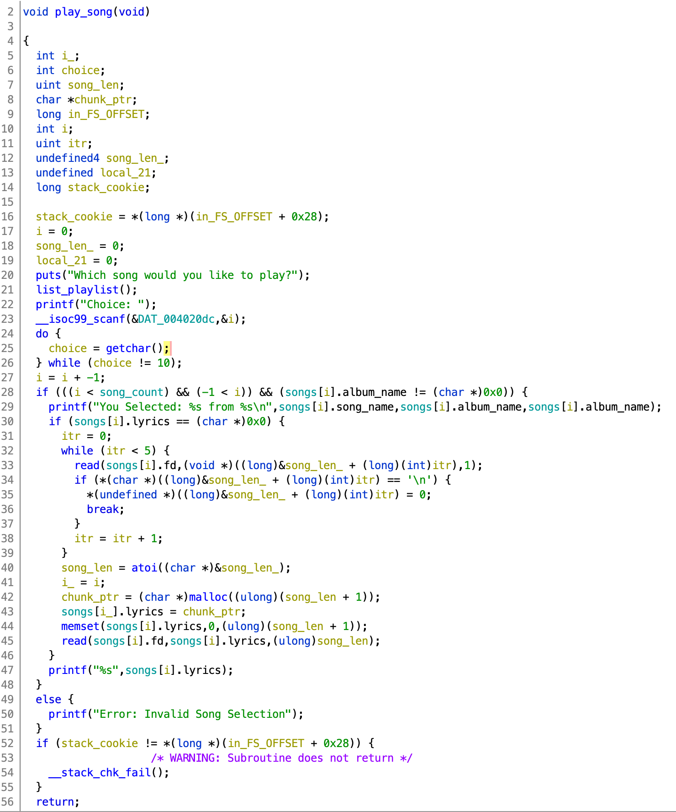

# Writeup for TikTok

**_If you've ever wondered 'which Ke$ha songs are short enough to fit into a Tcache bin?' this is the challenge for you._**

### Challenge Files

+  **`tiktok`**

```
➜ file tiktok
tiktok: ELF 64-bit LSB executable, x86-64, version 1 (SYSV), dynamically linked, interpreter /lib64/l, for GNU/Linux 3.2.0, BuildID[sha1]=67770a05ca9e8cc1057161a438e9da38c66321a9, not stripped

➜ checksec tiktok
[*] '/home/.../dawgctf2020/tiktok'
    Arch:     amd64-64-little
    RELRO:    Full RELRO
    Stack:    Canary found
    NX:       NX enabled
    PIE:      No PIE (0x400000)
```

+ **`libc-2.27.so`**

+ ***`Animal/, Warrior/, Cannibal/, Rainbow/`***

Four folders for each of Kesha's albums, which contain their respective songs as `.txt` files, each beginning with the length of the song in bytes. For example
```
➜ cat Animal/tiktok.txt
2117
Wake up in the morning feeling like P Diddy (Hey, what up girl?)
Grab my glasses, I'm out the door; I'm gonna hit this city (Let's go)
Before I leave, brush my teeth with a bottle of Jack
'Cause when I leave for the night, I ain't coming back
...
```

### Vulnerability 

The very first step, and probably the most important part of solving this challenge, is to put on Ke$ha. Personally, I preferred her most recent album for vulnerability discovery, and her earlier work for exploitation, but to each their own. 

After I had [Praying](https://www.youtube.com/watch?v=v-Dur3uXXCQ) playing, I ran the binary. This was the output:

```
➜ ./tiktok
Welcome to my tik tok rock bot!
I really like Ke$ha, can you help me make a playlist?

So what would you like to do today?
1. Import a Song to the Playlist
2. Show Playlist
3. Play a song from the Playlist
4. Remove a song from the Playlist
5. Exit
Choice:
```

Next I decompiled the binary. Option2 2 and 5 were rather straightforward (2 outputs the playlist and 5 exits the program), but Options 1, 3, and 4 looked interesting. 

##### Import Song

Below is the edited decompilation of `import_song`, the function that gets called when selecting Option 1. 


When `listoptions()` gets called it will `ls -R` the directory it's in. By netcatting into the challenge server, we can see the contents of the directory, which contains a `flag.txt` and the same song folders and files that we have. 

From lines 20-24 we can see that the user supplies a file path that must exist, can't contain the strings `"flag"` and `".."` and must begin with a capital letter between A and Z (no absolute paths). Given the contents of the challenge directory, the only available option is to send a path of one of the song files, i.e. `<Album_Name>/<song_name>.txt` (*or* just the path of an album directory, i.e. `<Album_Name>/`, which will be relevant later). 

The file path is getting read into an array of structs, which is our playlist of imported songs. Each struct is 56 bytes long, with 7 fields. The decompilation is a little wonky, but `hacky_...` refers to the fields in the first struct in the array. `hacky_fd_reference` is cast a `DWORD`, whereas everything else is a `QWORD` so that's why it's being increased `14 * song_ctr` rather than `7*song_ctr`. Below is what the song struct looks like. 


The first 24 bytes of the struct is a 24 bytes array of the song file path. Directly below it is a 4 byte file descripter that gets assigned when the file path is opened. Below that is 4 bytes of padding, and then 3 pointers. The first pointer pointer points will point at the file path, the second will point at the file name and the third will point into the heap (given intended program behavior). 

Where do the first two pointers get assigned? In lines 30 and 32, with Ke$ha's favorite function, [strtok](http://www.cplusplus.com/reference/cstring/strtok/). While my first instinct was to look there for vulnerabilities, that would be a rookie mistake. Clearly the first thing any good vulnerability researcher would do at this situation is put on [TikTok](https://www.youtube.com/watch?v=iP6XpLQM2Cs) by Ke$ha.

Now that I was appropriately in the zone, I could look at the strtoks. Obviously in real life, it took some time to find the bug, so let's fast forward to probably the 10th round of TikTok, at which point I felt the need to change [songs](https://www.youtube.com/watch?v=1yYV9-KoSUM). The first strtok scans the song_file_path to find a token ending in `/` character. Once done, it replaces that with a null byte, and returns a pointer to the beginning of the token. The second strtok starts at the byte afterwhich the last strtok call left off, so in this case the beginning of our song name, and scans until it finds a '.' character, at which point it replaces that '.' with a nullbyte and returns a pointer to the beginning of the song name. 

This is all just a very verbose way of saying that it parses the parent directory and song name into seperate strings, stripping off the '/' and '.txt'. i.e. 
`songs[i].song_file_path = "Animal/tiktok.txt"` will become `songs[i].song_file_path = "Animal<0x00>tiktok<0x00>txt"`
`songs[i].song_dirname_ptr = &hacky_dir_reference + 7*i` points to 'Animmal' and `songs[i].song_name_ptr = &hacky_name_no_reference + 7*i` points to 'tiktok'. Now this all becomes very interesting when you realize two things. 

1) The `read` on line 10 reads in up to 24 bytes, exactly the size of `songs[i].song_file_path`. This means that if the user gives a filepath that is 24 bytes long, no null byte will be appended on the end. In each song struct, `songs[i].song_file_path`resides directly above `songs[i].fd` which brings me to 2). 
2) The file descriptor being saved in the struct is already suspicious, and now looks even more so. The first three fds for a Linux process, fd = 0, 1, 2 will (unless otherwise specified) be assigned to stdin, stdout and stderr. So when `open` is called, it will assign a new fd to the file it's opening, beginning with fd = 3. Every time a song is imported a new fd is open, and won't get closed until the user chooses to remove the song. That means that were the user to import, say, 44 songs, `songs[43].fd = 46`. Or, translated into ascii:
```
➜  python3
>>> chr(46)
'.'
```
If I import a song path of 24 bytes on my 44th import, and my song path contains no '.', then strtok will overwrite the song's file descriptor with a nullbyte, i.e. `songs[43].fd = 0`. A songs file descriptor gets read from when a song is played (we'll see this when we look at the `play_song` function, which means that if I were to play the 44th song, the program would take in input from stdin!

What can we do with this behavior? First we need to put on [Woman](https://www.youtube.com/watch?v=lXyA4MXKIKo) by Ke$ha. Next we look at where the fd gets read from, which is in `play_song` (Option 3). 




